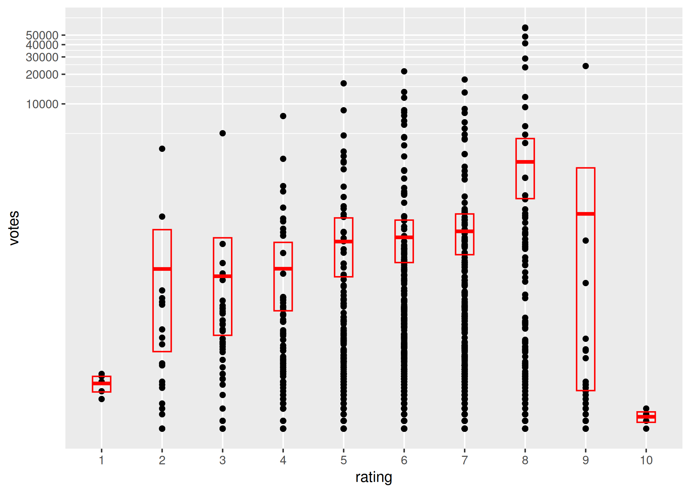

<!-- README.md is generated from README. Rmd. Please edit that file -->

Part of this workshop has been adapted from (Thomas Lin Pedersen) GitHub
repository: [link](https://github.com/thomasp85/ggplot2_workshop)

Link to YouTube video: <https://www.youtube.com/watch?v=h29g21z0a68>

Plenty of examples here:
[website](http://www.sthda.com/english/wiki/be-awesome-in-ggplot2-a-practical-guide-to-be-highly-effective-r-software-and-data-visualization)

**It’s dangerous to go alone! Take this
[cheatsheet](https://rstudio.github.io/cheatsheets/data-visualization.pdf)**

## Libraries needed for this workshop:

``` r
packages <- c('ggplot2', 'dplyr', 'grid', 'gridExtra', 'tidyr', 'reshape2')

# Install packages not yet installed
installed_packages <- packages %in% rownames(installed.packages())
if (any(installed_packages == FALSE)) {
  install.packages(packages[!installed_packages])
}

# Packages loading
invisible(lapply(packages, library, character.only = TRUE))

# Optional (for some examples):
optional_packages <- c(
  'maps',
  'ggrepel',
  'ggraph',
  'igraph',
  'tidygraph',
  'GGally',
  'ggtree',
  'wordcloud2',
  'gt',
  'RColorBrewer'
)

devtools::install_github("mattflor/chorddiag")

# Install packages not yet installed
installed_packages <- optional_packages %in% rownames(installed.packages())
if (any(installed_packages == FALSE)) {
  install.packages(optional_packages[!installed_packages])
}

# Packages loading
invisible(lapply(optional_packages, library, character.only = TRUE))

## treeio is available in Bioconductor

install.packages("BiocManager")
BiocManager::install("treeio")
#> Warning: package(s) not installed when version(s) same as or greater than current; use
#>   `force = TRUE` to re-install: 'treeio'
```

## Reshaping data

A dataset can be written in two different formats: wide and long. A wide
format has values that do not repeat in the first column. A long format
has values that do repeat in the first column. Iris data is presented in
wide format. In some cases ggplot will require long format in order to
plot the data correctly. To transform from wide to long we have several
options:

``` r

data(iris)
head(iris)
#>   Sepal.Length Sepal.Width Petal.Length Petal.Width Species
#> 1          5.1         3.5          1.4         0.2  setosa
#> 2          4.9         3.0          1.4         0.2  setosa
#> 3          4.7         3.2          1.3         0.2  setosa
#> 4          4.6         3.1          1.5         0.2  setosa
#> 5          5.0         3.6          1.4         0.2  setosa
#> 6          5.4         3.9          1.7         0.4  setosa

# gather() from tidyr
head(gather(iris,                      # Data object
       feature,                   # Name of new key column (made from names of data columns)
       value,                     # Name of new value column
       Sepal.Length:Petal.Width,  # Names of source columns that contain values
       factor_key=TRUE))           # Treat the new key column as a factor (instead of character vector)
#>   Species      feature value
#> 1  setosa Sepal.Length   5.1
#> 2  setosa Sepal.Length   4.9
#> 3  setosa Sepal.Length   4.7
#> 4  setosa Sepal.Length   4.6
#> 5  setosa Sepal.Length   5.0
#> 6  setosa Sepal.Length   5.4

# melt() from reshape2
head(
  melt(iris, id.vars=c("Species"))  # Specify id.vars: the variables to keep but not split apart on
)
#>   Species     variable value
#> 1  setosa Sepal.Length   5.1
#> 2  setosa Sepal.Length   4.9
#> 3  setosa Sepal.Length   4.7
#> 4  setosa Sepal.Length   4.6
#> 5  setosa Sepal.Length   5.0
#> 6  setosa Sepal.Length   5.4
# There are options for melt that can make the output a little easier to work with:
head(
  melt(iris,
       id.vars=c("Species"),                            # ID variables - all the variables to keep but not split apart on
       measure.vars=c("Sepal.Length", "Sepal.Width",    # The source columns
                      "Petal.Length", "Petal.Width"),
       variable.name="variable",                        # Name of the destination columns that will identify the original columns that the measurement came from
       value.name="value")
)
#>   Species     variable value
#> 1  setosa Sepal.Length   5.1
#> 2  setosa Sepal.Length   4.9
#> 3  setosa Sepal.Length   4.7
#> 4  setosa Sepal.Length   4.6
#> 5  setosa Sepal.Length   5.0
#> 6  setosa Sepal.Length   5.4
```

To transform from long to wide you can use spread()

## Basic plot with ggplot and mapping

The main function of ggplot is the `ggplot()` function. It has two main
arguments that you need to be aware of:

Data: the (default) dataset to use for the plot Mapping: the aesthetic
mappings

When calling `ggplot()` we typically don’t call these arguments by their
name and instead simply supply them in order.

### Data

The data argument obviously needs a dataset and this should usually come
in the form of a data.frame or a tibble. Let’s starts with a very simple
data set, iris, that contains 4 measures + species name for each plant.

### Mapping

The mapping argument should be supplied with a call to the `aes()`
function that lists the mappings between variables in your ta and
aesthetics of the plot. Which aesthetics you choose to map to depends on
what geoms you intend to use. But for now, let’s assume that we want to
map “Petal.Length” to the x axis, and “Petal.Width” to the y axis. To do
so, we simply use `aes(x = Petal.Length, y = Petal.Width)` as the input
to the mapping argument. Because the first two arguments of aes() are x
and y, we can do without calling them explicitly.

``` r
ggplot(data = iris,
       mapping = aes(x = Petal.Length,
                     y = Petal.Width))
```


Why does this result in a blank canvas? After all, we did tell ggplot to
map Petal.Length to the x axis and Petal.Width to he y axis? The answer
is that we still haven’t told ggplot2 which layers we want to use.

### Layers

To add new layers to the main function we only need to ‘add’ (+) the
code for the new layer. The aesthetic mapping is not enough by itself—we
also need a layer to display our data. In ggplot2, we accomplish this by
adding (stacking) layers to the output of ggplot(). There are several
ways to construct layers in ggplot, but the simplest and most common
approach is to use the functions named `geom_*()` (such as
`geom_point()`).

### Aesthetics

Aesthetics mapped in ggplot() will be shared between all layers Each
aesthetic can have its own mapping. You can look at the documentation of
the `geom_*()` function using the help function in R

`?geom_point()`Under Aesthetics we can see that this layer understands
the following aesthetics: x y alpha colour fill group shape size stroke

Exercises: 1) Generate a dotplot for Petal.Length ~ Petal.Width 2) Add a
regression line (geom_smooth() with `formula = y ~ x` and `method='lm'`
3) Using the previous plot, map the speceies data to the color of the
dots. Try first to do the mapping on the geom_point nction and then
mapping it on the main function ggplot() 4) Change size and shape of
dots 5) Add a rectangle (`geom_rect()`) and fill it in green
(`?geom_rect`)

### geoms

Exercises: 1) Plot Species names instead of dots using geom_text. You
will need to map Species names to `label` 2) Generate a boxplot or
violinplot for Petal.Length data with one box for each species 3) Repeat
the boxplot but now try to have all variables (Petal.Length,
Petal.Width, Sepal.Length, Sepal.Width) in the same lot (\*You need the
long format to do this plot) 4) Plot the distribution of Petal.Length by
species (geom_density()) 5) Add the bar plot on top of the previous
density plot. Use position=“dodge” to plot the bars side by side

### stats

To know which statistics are calculated on each stat\_\* function check
the section ‘Computed variables’ on its help page We can access this
calculated values using after_stat() ?stat_count

### Exercises:

1)  Generate a barplot showing car counts per classes using mpg dataset.
    Show counts in percentage of the total. This will require a new
    mapping in the geom

``` r
ggplot(mpg, aes(x=class)) +
  stat_count()
```


``` r
# is the same than
ggplot(mpg, aes(x=class)) +
  geom_bar()
```


``` r
# geom_bar uses the default values from stat_count to generate the plot
# we can access the statistics calculated by stat_count using after_stat()
ggplot(mpg, aes(x=class)) +
  geom_bar( aes( y = after_stat(100*count/sum(count)) ))
```


``` r


# More examples
# Add significance level
library("ggpubr")
ggplot(iris, aes(x=Species, y=Petal.Length, color=Species, fill=Species)) +
  geom_boxplot(alpha=.3) +
  stat_compare_means(label.y = 10) +
  stat_compare_means(comparisons = list(c(1,2), c(1,3), c(2,3)),
                     label = "p.signif") + theme_bw()
```


## Multiplots

`facet_grid()` allows us to split data in different panels according to
specific variables To do so it is recommended to use the long format
This function will split (map) the data into `rows ~ columns` If we only
want to split data into rows then we add a “.” for columns, like this:
`rows ~ .`

Exercises: 1) Plot the distribution of each measure (`Sepal.Length`,
`Sepal.Width`, …) in different rows, map Species to colors 2) Now split
the previous plot by placing each Species in different columns (keep
variables in different row) 3) Make the plots easier to read by
adjusting the Y scale in each row (check ?facet_grid to find the correct
option) facet_grid draws 1 plot on a canvas. We can draw different plots
on 1 canvas using grid.arrange (libraries grid & gridExtra) Shape of
grid can be specified by a `layout_matrix` We need to pass a list of
ggplot objects (or ‘grobs’) as input \*A graphical object (“grob”) is a
description of a graphical item. These basic classes provide default
behaviour for validating, drawing, and modifying graphical
objects.Exercises: 1) Save 2 ggplots into 2 different grob objects 2)
Use grid.arrange() to plot the previous 2 objects together, either in 2
columns or in two rows 3) Draw the 2 plots with the same size and
without legend ( `... + theme(legend.position = "none")` ) and make them
share the same legend (Hint: use the following code to extract the
legend as a grob)

``` r

# function to extract legend from plot
get_only_legend <- function(plot) {
  plot_table <- ggplot_gtable(ggplot_build(plot))
  legend_plot <- which(sapply(plot_table$grobs, function(x) x$name) == "guide-box")
  legend <- plot_table$grobs[[legend_plot]]
  return(legend)
}
```

## Scales & Coordinates

Coordinates allows us to transform mappings. For example: - a cartesian
coordinates system allows us to zoom in and out of a plot - a polar
coordinate system interprets x and y as angles and radius example:
`p3 + scale_y_reverse()`

The commands for scales follow the pattern
scale\_‘aesthetic’\_‘mehtod’() Exercises: 1.1) Using `Sepal.Length` draw
a bar plot and fill the bars by species 1.2) Scale x axis into bins 1.3)
zoom in by scaling the y axis (`scale_y_continuous`) and set the limits
to show only data below 10 counts 1.4) repeat the zoom in but this time
using `coord_cartesian()`. Compare results with previous step

2.1) Using the following exponential data transform the axis so dots
follow a straight line (diagonal)

3.1) Use the following data to create a bar chart with only one stacked
bar (`stat="identity"`, or use `geom_col()`), and fill by group (hint:
You can always map “” to a aesthetic) 3.2) Transform the y axis into
angles using `coord_polar(...)`

``` r

# BE CAREFUL WITH TRANSFORMATIONS!!
movies <- ggplot2movies::movies
mov <- movies[sample(nrow(movies), 1000), ]
mov
#> # A tibble: 1,000 × 24
#>    title     year length budget rating votes    r1    r2    r3    r4    r5    r6
#>    <chr>    <int>  <int>  <int>  <dbl> <int> <dbl> <dbl> <dbl> <dbl> <dbl> <dbl>
#>  1 T-Force   1995    105     NA    3.1    74  14.5  14.5  14.5  14.5   4.5   4.5
#>  2 Johnny …  1963    103     NA    6.6    65   4.5   0     4.5   4.5   4.5  14.5
#>  3 Hound H…  1947      7     NA    6.9    22   0     0     0     0    14.5  14.5
#>  4 Stanza …  1998     89     NA    6.8    17  14.5   0     0     0     0    24.5
#>  5 Ni liv    1957     96     NA    7.7   172   4.5   4.5   4.5   4.5   4.5   4.5
#>  6 Mother …  1938     82     NA    6.4    15   0     0     0     0     4.5  24.5
#>  7 Iron Gi…  1994     80     NA    2.2    23  64.5   4.5   4.5   0     0     0  
#>  8 Black S…  1957     88     NA    4.8   238   4.5   4.5  14.5  14.5  14.5  14.5
#>  9 Lion an…  1952     83     NA    4.9    15   0     4.5   4.5   4.5   4.5  14.5
#> 10 Emoh Ruo  1985     93     NA    6.1    16   0     0     0     4.5   4.5   4.5
#> # ℹ 990 more rows
#> # ℹ 12 more variables: r7 <dbl>, r8 <dbl>, r9 <dbl>, r10 <dbl>, mpaa <chr>,
#> #   Action <int>, Animation <int>, Comedy <int>, Drama <int>,
#> #   Documentary <int>, Romance <int>, Short <int>
m1 <- ggplot(mov, aes(x = factor(round(rating)), y = votes)) +
  geom_point() +
  stat_summary(fun.data = "mean_cl_boot",
               geom = "crossbar",
               colour = "red", width = 0.3) +
  xlab("rating")
# Transforming the scale means the data are transformed first,
# after which statistics are computed:
p1 <- m1 + scale_y_log10(breaks=c(10000, 20000, 30000, 40000, 50000, 100000, 150000))
p1
```


``` r
# Transforming the coordinate system occurs after the
# statistic has been computed. This means we're calculating the summary on the raw data
# and stretching the geoms onto the log scale.
# Compare the widths of the standard errors.
p2 <- m1 + coord_trans(y="log10") + scale_y_continuous(breaks=c(10000, 20000, 30000, 40000, 50000, 100000, 150000))
p2
```



``` r

grid.arrange(m1, p1, p2, ncol=3)
```


## colors & themes

manual control of color/fill scales The comands follow the pattern
`scale_<aesthetic>_<mehtod>()` `scale_fill_distiller()` \# to provide a
ColorBrewer palette `scale_color_viridis()` \# to use Viridis. Do not
forget `discrete=FALSE` for a continuous variable.
`scale_fill_viridis_[b: binary; c:continuos; d:discrete]()`
`scale_fill_manual()` \# to provide manual colors to fill list of color
names for ggplot2:
<http://sape.inf.usi.ch/quick-reference/ggplot2/colour>

``` r

# Dummy data
x <- LETTERS[1:20]
y <- paste0("var", seq(1,20))
data <- expand.grid(X=x, Y=y)
data$Z <- runif(400, 0, 5)
```

Exercises: 1) Using the data above draw a heatmap (geom_tile()) 2)
Change the filling using different scale\_\* 3) Use iris data to draw
again a box plot and change color and fill manually

Any other aesthetic in the plot can be modify using theme Inside
theme(…) you can control aesthetics for panel, plot, axis, legend, …
Each aesthetic is defined by an `element_'shape'` constructor (text,
line, blank, …) e.g. ggplot() + theme(axis.text = element_text(size=12))
-\> To control the fontsize of (both) axis texts There are some
predefined themes in ggplot such as theme_bw(). theme_minimal(),
theme_classic(), .. Exercises: 1) Modify the aesthetics of your last
plot to make it more appealing

# annotation

This function adds geoms to a plot, but unlike a typical geom function,
the properties of annotations are not mapped from variables of a data
frame, but are instead passed in as vectors. This is useful for adding
small annotations (such as text labels)

``` r


# Using the dot plot from the first examples...
p <- ggplot(iris, aes(Petal.Length, Petal.Width, color=Species)) +
  geom_point(size=3) +
  stat_smooth(method = "lm",
              formula = y ~ x,
              geom = "smooth",
              alpha=.2)
p
```


